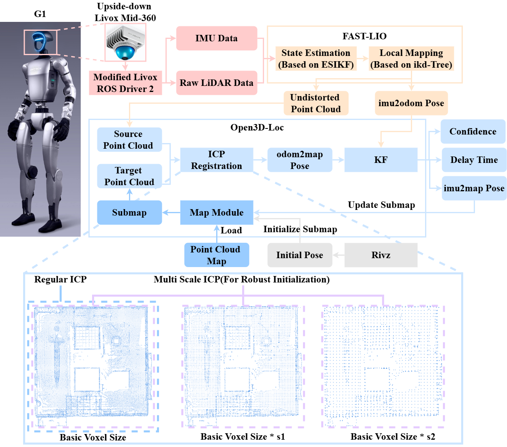
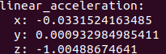
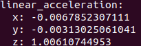
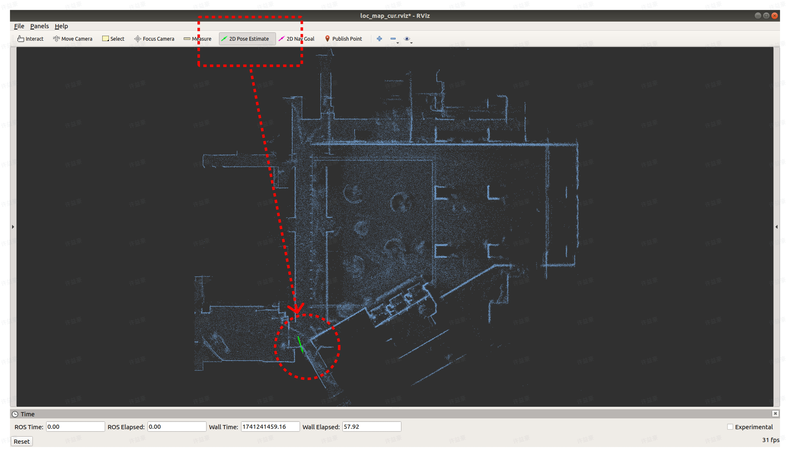
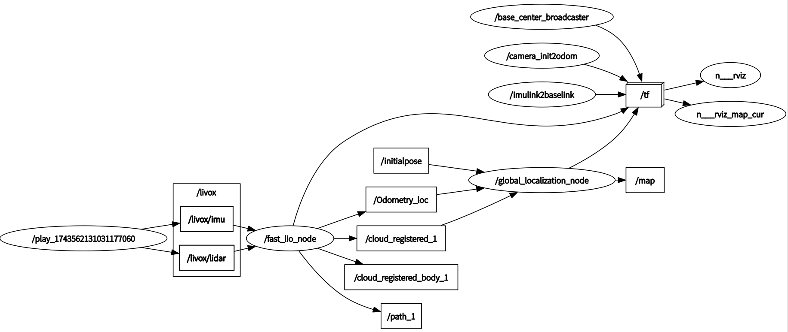

## 📢 Updates

- 🎉 **2025-12-01** : ROS2 (Humble) version already supports this , please check the Humble branch.

## 0. Highlight

### 0.0 Pipeline

<div align="center">

</div>

### 0.1 Modified livox_ros_driver2 for Unitree G1

**Livox MID360** on **Unitree G1** is upside down, the original **livox_ros_driver2** only allows modifying pointcloud extrinsics, not IMU. Our **modified livox_ros_driver2** can change both.

Left is original, pointcloud is upside down and gravity acceleration measured by the IMU is negative, right is our modified.

<div align="center">


</div>
<div align="center">


</div>

**Livox MID360** coordinate system on the **Unitree GO2** and the robot dog's physical coordinate system differ only by **6°** on the Y-axis. We can directly choose to use the official driver.

<div align="center">

</div>

### 0.2 Robust localization based on offline pointcloud map

Our solution can handle **rough initial pose**, allows **robust localization**, and offline pointcloud map guarantee **no accumulated localization errors** caused by long hours of work(unlike common SLAM).In addition, we also tested it with a **robot dog**, and the visualization effect of the **colored point cloud** was better.

<div align="center">


</div>

### Contributors

[Axiang Sun 孙阿祥](https://github.com/MichaelSun1001)，朱峻峰，[Yihao Xu 许益豪](https://github.com/liaraaaaaaa), [Xin Li 李鑫](https://github.com/carlos-lee123), [Zhongxia Zhao 赵仲夏](https://github.com/xiaranqing), Gaohao Zhou 周高豪, Dongliang Li 李栋梁, [Xiang An 安翔](https://github.com/anxiangsir), Ziyong Feng 冯子勇，[Huajie Tan 谭桦杰](https://github.com/tanhuajie)

If you use in an academic work, please cite:

Yihao Xu, Xin Li, Zhongxia Zhao, Gaohao Zhou, Dongliang Li, Xiang An, Huajie Tan, Ziyong Feng, (2025) FAST_LIO_LOCALIZATION_HUMANOID [Source code]. https://github.com/deepglint/FAST_LIO_LOCALIZATION_HUMANOID.

## 1. Prerequisites

### 1.1 Ubuntu and ROS

* Ubuntu 18.04 for ROS Melodic
* Ubuntu 20.04 for ROS Noetic
* Ubuntu 22.04 for ROS Humble

The following processes have been tested in a pure Ubuntu 20.04 / 22.04 virtual machine.

### 1.2. PCL & Eigen & C++

Install LLVM C++ Standard library by following command.

```
sudo apt install libc++-dev libc++abi-dev
```

For ROS Melodic and ROS Noetic, the default PCL and Eigen is enough.

Install Eigen by following command.

```
sudo apt-get install libeigen3-dev
```

### 1.3. Open3D

Recommend use the precompiled Open3D library we provided. It can be downloaded from [Baidu Netdisk](link: https://pan.baidu.com/s/1vTLXVYJ6JBlbhNpDf87Cdg?pwd=spdg pwd: spdg), ``open3d141.zip``(tested) can be used for x86 architecture and ``open3d141_arm.zip``(not fully tested) can be used for arm architecture.

Open [open3d_loc/CMakeLists.txt](open3d_loc/CMakeLists.txt), replace ``Open3D_DIR`` by the folder where you unziped open3d141.zip.

```
#For example
set(Open3D_DIR "/home/liar/open3d141/lib/cmake/Open3D")
```

Or, build from source by yourself, follow the guidance of installation in the [Open3D documentation/Build from source](https://www.open3d.org/docs/release/compilation.html).

### 1.4 Livox-SDK2

Follow the guidance of installation in the [Livox-SDK2](https://github.com/Livox-SDK/Livox-SDK2)

### 1.5 Livox-SDK & livox_ros_driver (for fast_lio)

Since the fast_lio must support Livox serials LiDAR firstly, so the **livox_ros_driver** must be installed

Follow the guidance of installation in the [Livox-SDK](https://github.com/Livox-SDK/Livox-SDK) and [livox_ros_driver](https://github.com/Livox-SDK/livox_ros_driver)

## 2. Build

Source livox_ros_driver before build (for fast_lio).

```
#In the same terminal

#Source livox_ros_driver before every build
cd ~/ws_livox/
source devel/setup.bash

#The first build requires a new workspace
mkdir -p ~/ws_loc/src

#Get code
cd ~/ws_loc/src
git clone https://github.com/deepglint/FAST_LIO_LOCALIZATION_HUMANOID.git
cd ..

#Build
catkin_make -DROS_EDITION=ROS1
```

## 3. Parameter Configuration

### 3.1 livox_ros_driver2

Remember to modify your computer ip address, follow [G1 SDK Development Guide/Lidar Route](https://support.unitree.com/home/zh/G1_developer/lidar_Instructions).

If you need to adjust the extrinsics of the pointcloud and IMU, just modify the ``extrinsic_parameter`` in [livox_ros_driver2/config/MID360_config.json](livox_ros_driver2/config/MID360_config.json).

```
#For example, "roll" for reversed Livox MID360 on Unitree G1 is 180.0

    "lidar_configs" : [
    {
      "ip" : "192.168.123.120",
      "pcl_data_type" : 1,
      "pattern_mode" : 0,
      "extrinsic_parameter" : {
        "roll": 180.0,
        "pitch": 0.0,
        "yaw": 0.0,
        "x": 0,
        "y": 0,
        "z": 0
      }
    }
  ]
```

If you need to modify other parameters(such as ip), follow the [livox_ros_driver2](livox_ros_driver2/README.md)

### 3.2 fast_lio

The default parameter configuration is OK.

If you need to modify parameters, follow the [FAST_LIO](FAST_LIO/README.md).

### 3.3 open3d_loc

Place your pointcloud map in the [data](data) folder, and  change the ``path_map`` in [open3d_loc/launch/open3d_loc_g1.launch](open3d_loc/launch/open3d_loc_g1.launch) to your pointcloud map's location. Both ``.pcd`` and ``.ply`` formats are acceptable.

```
<param name="path_map" type="string" value="$(find open3d_loc)/../data/map.ply" />
```

 ``threshold_fitness_init`` is initial pointcloud registration threshold, ``threshold_fitness`` is regular pointcloud registration threshold. In different scenarios, the two thresholds may need to be tested and changed.

## 4. Run

### 4.0 pointcloud map

We do not provide specific mapping solutions, but recommend a few open-source mapping solutions, [FAST-LIO2](https://github.com/hku-mars/FAST_LIO) and [Point-LIO](https://github.com/hku-mars/Point-LIO) is enough for small-scale scenarios.

Recommend [CloudCompare](https://github.com/CloudCompare/CloudCompare) to fine tune pointcloud maps, such as aligning the ground or cropping out people's shadows.

(If we can get 100 stars, we will urge other colleagues to simplify and open source our mapping solutions for large-scale scenarios)

### 4.1 open3d_loc & fast_lio

```
source devel/setup.bash
roslaunch open3d_loc localization_3d_g1.launch
```

[open3d_loc/launch/localization_3d_g1.launch](open3d_loc/launch/localization_3d_g1.launch) starts ``open3d_loc`` and ``fast_lio`` at the same time.

``Rviz`` of fast_lio consumes some memory, so we disable ``rviz`` of ``fast_lio`` by default in [FAST_LIO/launch/mapping_mid360_g1.launch](FAST_LIO/launch/mapping_mid360_g1.launch)

```
<!-- <arg name="rviz" default="true" /> -->
<arg name="rviz" default="false" />
```

### 4.2 initial pose

In **rviz**, click **2D Pose Estimate**, and determine a position and orientation on the pointcloud map by **green arrow**.

<div align="center">

</div>

### 4.3 livox_ros_driver2

```
source devel/setup.bash
roslaunch livox_ros_driver2 msg_MID360.launch
```

### 4.4 rosbag

If you need to run based on rosbag, do not need to roslaunch **livox_ros_driver2**.However, rosbag must also be collected using our **modified livox_ros_driver2**.

```
#For example
rosbag play xxx.bag
```

If you need to check the delay time, set ``use_sim_time`` to "true" in [FAST_LIO/launch/mapping_mid360_g1.launch](FAST_LIO/launch/mapping_mid360_g1.launch) and [open3d_loc/launch/open3d_loc_g1.launch](open3d_loc/launch/open3d_loc_g1.launch), then

```
#For example
rosbag play xxx.bag --clock
```

### 4.5 check by rqt_graph

Roslaunch the above node, in the newly opened terminal check by following command.

```
rqt_graph
```

The correct graph is as follows, this is the case with rosbag. If you use livox_ros_driver2 directly, ``/livox_lidar_publisher2`` will replace ``/play_xxx`` in the graph.

<div align="center">

</div>

## 5. Result

| topics name                 | types name                | description                                                                           |
| --------------------------- | ------------------------- | ------------------------------------------------------------------------------------- |
| /localization_3d            | geometry_msgs/PoseStamped | localization result                                                                   |
| /localization_3d_confidence | std_msgs/Float32          | pointcloud registration fitness, higher the value, the more accurate the localization |
| /localization_3d_delay_ms   | std_msgs/Float32          | delay time between localization result and odometry(from fast_lio), in milliseconds   |

Check rostopic by following command.

```
#The same to /localization_3d_confidence and /localization_3d_delay_ms
rostopic echo /localization_3d
```

The delay time is tested in a **150m * 50m * 30m** large-scale pointcloud map, and the delay time is basically less than 30ms. The computer used in the test has 15GB of memory, CPU is 11th Gen Intel® Core™ i5-11400H @ 2.70GHz × 12, and the system is 64-bit Ubuntu18.04

<div align="center">

</div>

## 6. Demo

### 6.0 Rosbag for demo

- Also can be downloaded from [Baidu Netdisk](https://pan.baidu.com/s/1vTLXVYJ6JBlbhNpDf87Cdg?pwd=spdg) (pwd: `spdg`). `mapping.bag` is data for mapping, and `loc.bag` is data for positioning.

- We also provide a case study of a color point cloud map using a robot dog as the demo.You can download it via this [link](https://pan.baidu.com/s/1lN0ZjEEJDp8-3oz8JRtt7w?pwd=6bqu ). (pwd: `6bqu`)
- If you have an iPhone model with lidar, we strongly recommend using the ``3D Scanner`` app from the App Store to build and locate color point cloud maps.Refer to [doc/3DScanner.mp4](doc/3DScanner.mp4).

### 6.1 Mapping

Use **fast_lio** to do mapping.

Refer to [doc/demo_mapping_fastlio.mp4](doc/demo_mapping_fastlio.mp4).

### 6.2 Fine tune(Recommend)

Use **CloudCompare** to fine tune. Downsampling to reduce the size of the pointcloud map, align the ground plane, and try to ensure that the z-axis of the ground is 0.

Refer to [doc/demo_finetune.mp4](doc/demo_finetune.mp4).

### 6.2 Localizaiton

Refer to [doc/demo_loc.mp4](doc/demo_loc.mp4).

## 7. Acknowledgments

In this work, the odometer module is based on [FAST-LIO2](https://github.com/hku-mars/FAST_LIO), the localization module refers to [FAST_LIO_LOCALIZATION](https://github.com/HViktorTsoi/FAST_LIO_LOCALIZATION), thanks to their great work.
